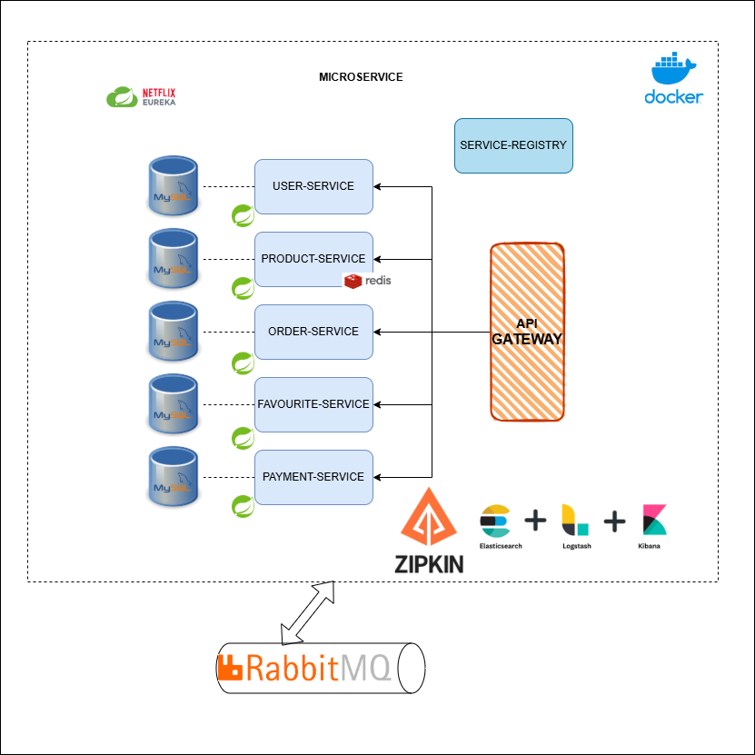
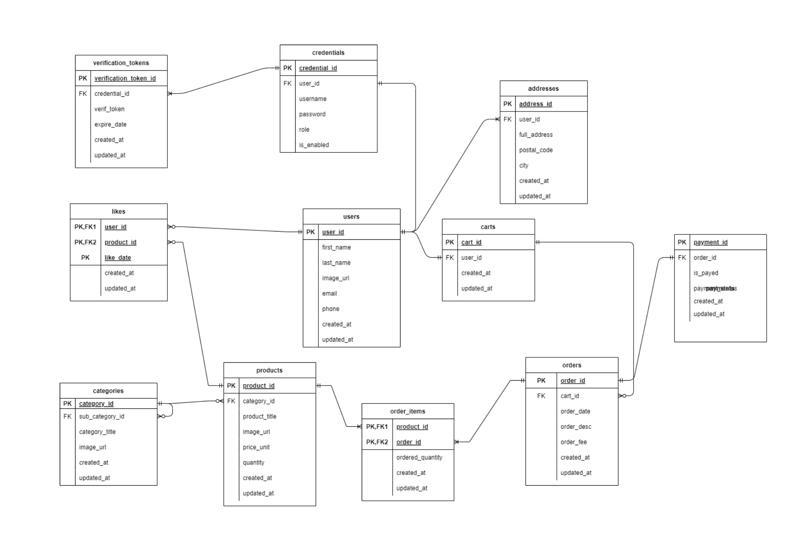
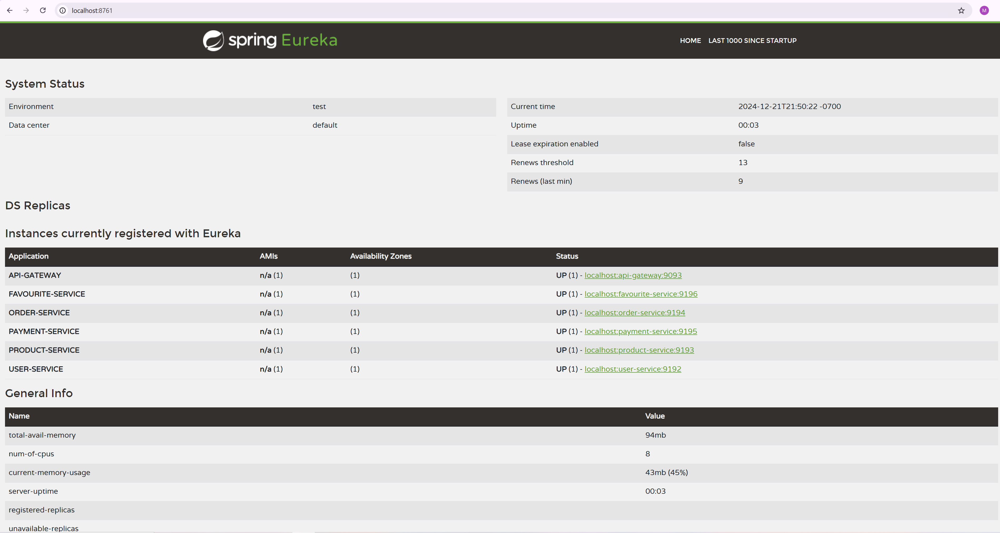
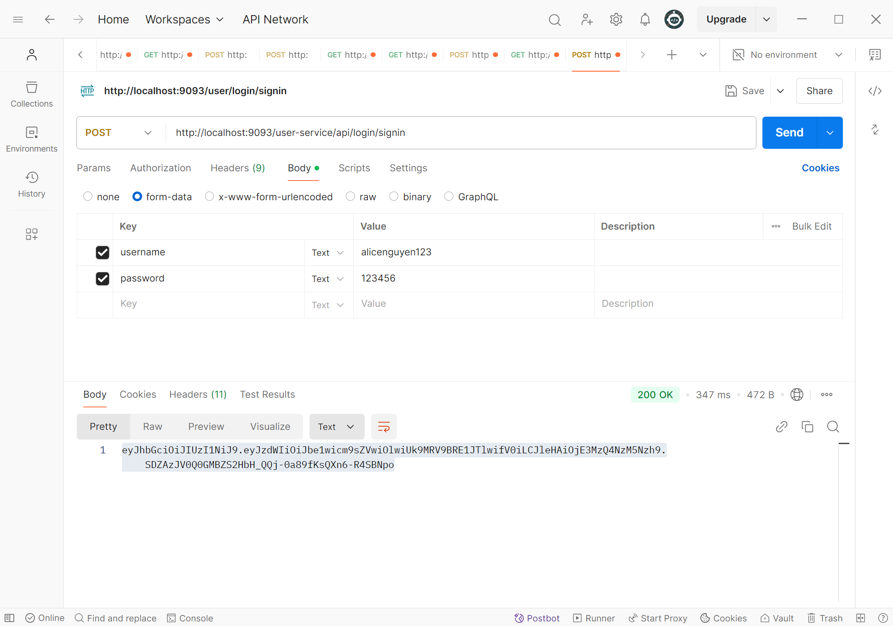
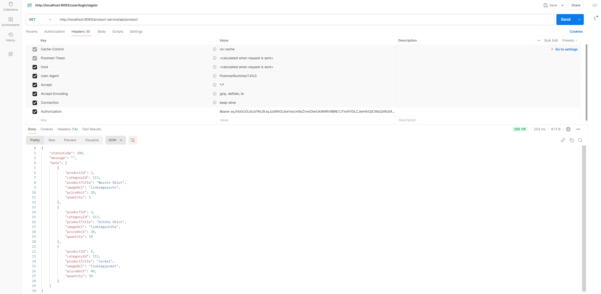
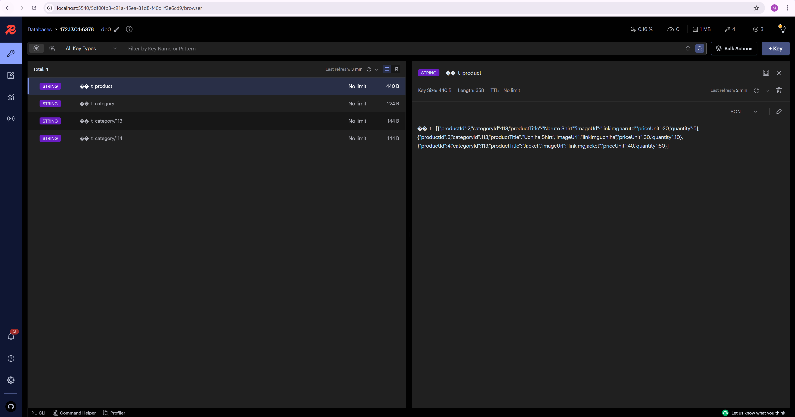

# E-Commerce Microservice
## Introduction
Welcome to the E-commerce Microservice Platform – a modern, scalable, and modular e-commerce system built with Spring Boot and designed to deliver a seamless and efficient shopping experience. This project follows best practices for microservice architecture, enabling easy maintainability, scalability, and deployment.

The platform consists of multiple independent services for managing users, products, orders, and payments, each communicating via well-defined RESTful APIs. It leverages technologies such as JWT-based authentication, RabbitMQ for asynchronous messaging, and Redis for caching, ensuring high performance and security.

With a focus on professional-grade development practices, this project integrates Swagger documentation for API clarity, ELK Stack for comprehensive logging and monitoring, and Docker for containerized deployment. Additionally, Eureka Server provides service discovery for improved scalability, while CI/CD pipelines streamline automated builds and deployments.


## System Architecture



## Entity-Relationship-Diagram


## Getting started
### Prerequisites

Before you begin, ensure you have met the following requirements:

1. **Java 17**: JDK 17 can be downloaded and installed from [https://www.oracle.com/java/technologies/javase/jdk11-archive-downloads.html](https://www.oracle.com/java/technologies/javase/jdk17-archive-downloads.html)

1. **Maven**: Apache Maven is a software project management and comprehension tool, it can be downloaded from here https://maven.apache.org/download.cgi

1. **Postman**: Execute, test, and interact with APIs in seconds. It can be downloaded from https://www.postman.com/downloads/

1. **Docker**:  A platform designed to help developers build, share, and run container applications. It can be installed from https://www.docker.com/

#### 1. Clone the project:

```bash
> git clone [https://github.com/MinhNguyenIT/microservice-ecommerce.git]
```

#### 2. Navigate to the project directory:

```bash
  cd project-name-backend
```

#### 3. Build the project:

```bash
  # Using Maven
  mvn clean install 
```

#### 4. Configure the database:

- Update `application.properties` or `application.yml` with your database connection details.

#### 5. Run the application:

```bash
  # Using Maven
  mvn spring-boot:run
```

```bash
---------------< com.mk.app:microservice-ecommerce >-----------
[INFO] ------------------------------------------------------------------------
[INFO] Reactor Summary for microservice-ecommerce 0.1.0:
[INFO] 
[INFO] microservice-ecommerce ............................. SUCCESS [  0.548 s]
[INFO] service-registry ................................... SUCCESS [  3.126 s]
[INFO] cloud-config ....................................... SUCCESS [  1.595 s]
[INFO] apigateway ......................................... SUCCESS [  1.697 s]
[INFO] user-service ....................................... SUCCESS [  2.546 s]
[INFO] product-service .................................... SUCCESS [  2.214 s]
[INFO] favourite-service .................................. SUCCESS [  2.072 s]
[INFO] order-service ...................................... SUCCESS [  2.241 s]
[INFO] payment-service .................................... SUCCESS [  2.006 s]
[INFO] ------------------------------------------------------------------------
[INFO] BUILD SUCCESS
[INFO] ------------------------------------------------------------------------
[INFO] Total time:  18.045 s
[INFO] Finished at: 2024-12-29T19:52:57+01:00
[INFO] ------------------------------------------------------------------------
```


## Demo
### Access Service Discovery Server (Eureka)
Go to this URL http://localhosts:8761 to see all the services registered in Eureka server.



### Authenticate and Retrieve JWT Token
To authenticate and retrieve a JWT token, follow these steps:
1. Open Postman and create a POST request to the following URL:
```bash
  http://localhost:9093/user-service/api/login/signin   
```
2. In the request body, select the form-data option and add the following key-value pairs:
```bash
  Key: username | Value: <YourUsername> (as saved in your database)
  Key: password | Value: <YourPassword> (as saved in your database)
```
3. If the credentials are valid, you will receive a response containing a JWT token. Use this token for accessing protected endpoints in your application.
   


### Test Service via Postman
Test product service:
1. Open Postman and navigate to the following URL:
```bash
  http://localhost:9093/user-service/api/login/signin  
```
2. In the Headers section of the request, add the following key-value pair:
```bash
  Key: Authorization
  Value: Bearer <JWT_Token> // Replace <JWT_Token> with the token obtained from the login process
```
3. Send the GET request.
4. If the token is valid, you will receive a response containing product data from the Product Service.



### Test Redis
1. Start Redis and Redis Insight Containers:
   
Use the following commands to start the containers:
```bash
docker run -d --name redis -p 6379:6379 redis
docker run -d --name redis-insight -p 5540:5540 redislabs/redisinsight
```
2. Access Redis Insight:
   
Open your browser and navigate to http://localhost:5540. Use Redis Insight to monitor and interact with the cache.
3. Test Cached Data:
After successfully caching product data, return to Postman and call the Product Service endpoint:
```bash
http://localhost:9093/product-service/api/product
```
In the response, observe that the data is now loaded from Redis, reducing the retrieval time significantly.
4. Benefits:
Using Redis as a cache improves performance by reducing database query times, particularly for frequently accessed data like product details.



   
