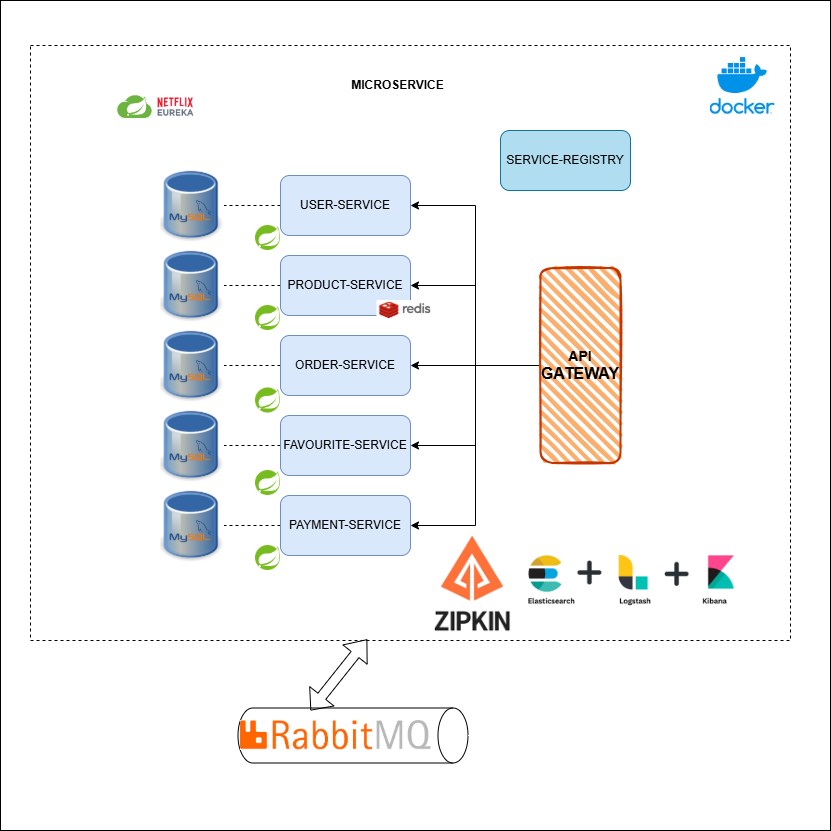
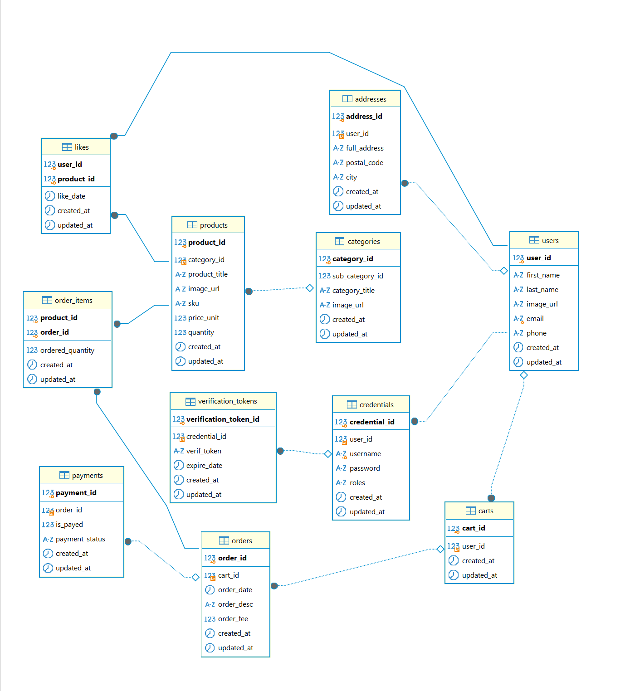

# E-Commerce Microservice
## Introduction
Welcome to the E-commerce Microservice Platform – a modern, scalable, and modular e-commerce system built with Spring Boot and designed to deliver a seamless and efficient shopping experience. This project follows best practices for microservice architecture, enabling easy maintainability, scalability, and deployment.

The platform consists of multiple independent services for managing users, products, orders, and payments, each communicating via well-defined RESTful APIs. It leverages technologies such as JWT-based authentication, RabbitMQ for asynchronous messaging, and Redis for caching, ensuring high performance and security.

With a focus on professional-grade development practices, this project integrates Swagger documentation for API clarity, ELK Stack for comprehensive logging and monitoring, and Docker for containerized deployment. Additionally, Eureka Server provides service discovery for improved scalability, while CI/CD pipelines streamline automated builds and deployments.

## Getting started
### System Architecture

### Prerequisites

Before you begin, ensure you have met the following requirements:

1. **Java 17**: JDK 17 can be downloaded and installed from [https://www.oracle.com/java/technologies/javase/jdk11-archive-downloads.html](https://www.oracle.com/java/technologies/javase/jdk17-archive-downloads.html)

1. **Maven**: Apache Maven is a software project management and comprehension tool, it can be downloaded from here https://maven.apache.org/download.cgi

1. **Postman**: Execute, test, and interact with APIs in seconds. It can be downloaded from 

1. **Docker**:  A platform designed to help developers build, share, and run container applications. It can be installed from https://www.docker.com/

## Data Model
### Entity-Relationship-Diagram

